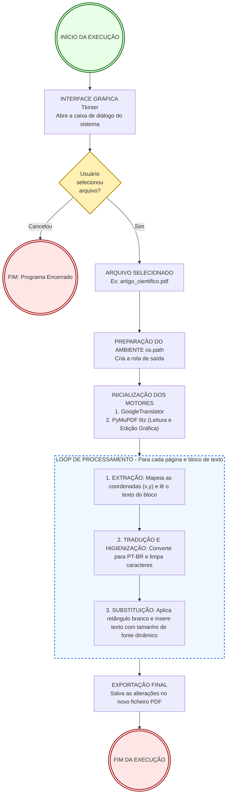

<p align="center">
  
  
  
  
</p>

<h2 align="center">✨ Automated PDF Manual Translator & Layout Preserver ✨</h2>

<p align="center">
  Script utilitário e modular desenvolvido meticulosamente para automação de leitura, extração e tradução de manuais técnicos e documentos em PDF do inglês para o português (PT-BR). A plataforma dispõe de uma interface gráfica nativa (Tkinter) para seleção dinâmica de arquivos, processamento de texto em blocos de coordenadas via PyMuPDF e tradução resiliente através da engine do deep-translator. O motor de geração atua com <strong>substituição no local (in-place replacement)</strong>, preservando perfeitamente o layout original (tabelas, imagens e colunas) e ajustando o tamanho da fonte dinamicamente (shrink-to-fit) para acomodar a tradução de forma elegante.
</p>

---

## 🎯 Objetivo do Projeto

O principal objetivo desta ferramenta é **quebrar a barreira do idioma em documentações técnicas**. 

Muitos equipamentos, sistemas e componentes possuem manuais densos e detalhados disponíveis exclusivamente em inglês. Este script foi criado para democratizar o acesso a essas informações essenciais, permitindo que qualquer usuário extraia, traduza e gere um novo documento em português de forma 100% automatizada. O foco é manter a organização visual e estrutural do material original, proporcionando uma leitura fluida, rápida e sem a necessidade de copiar e colar textos manualmente.

---

## ✨ Funcionalidades

* **Interface Amigável:** Utiliza o `tkinter` nativo para abrir caixas de diálogo do sistema operacional, eliminando a necessidade de digitar caminhos de pastas no terminal.
* **Preservação Visual Completa:** Como opera substituindo o texto nas coordenadas exatas, imagens, esquemas, tabelas e o design da página permanecem 100% intocáveis.
* **Ajuste Dinâmico de Fonte (Shrink-to-Fit):** Algoritmo inteligente que recalcula o tamanho da fonte (através de um laço `while`) garantindo que o texto traduzido encaixe perfeitamente na caixa original sem sobreposições.
* **Higienização de Caracteres:** Camada de segurança (sanitização e re-encoding) que limpa o retorno do tradutor, prevenindo falhas gráficas no PDF final.
* **Mapeamento de Destino:** Identifica a pasta de origem do arquivo selecionado e gera o arquivo formatado no mesmo diretório com o sufixo `_layout_mantido`.

---


## 📂 Estrutura do Projeto

```Bash
PDF-TRANSLATOR-PTBR/
├── fonts/
│   └── arial.ttf          # Fonte física para suporte a acentuação
├── venv/                  # Ambiente virtual integrado (ignorado)
├── .gitignore
├── LICENSE
├── main.py                # Script modular principal
├── README.md              # Documentação técnica do projeto
└── requirements.txt       # Manifesto de dependências do ecossistema
```

---

## 🧠 Arquitetura do Sistema

Abaixo está o fluxo detalhado de como o script processa o documento desde a seleção até a exportação final:



## 🚀 Como Instalar e Rodar

1. Pré-requisitos
   Python 3.8 ou superior instalado.

Arquivo de fonte arial.ttf alocado dentro do diretório fonts/.

## 2. Configurando o Ambiente
```Bash
# Clonar o repositório
git clone [https://github.com/SEU-USUARIO/pdf-translator-ptbr.git](https://github.com/SEU-USUARIO/pdf-translator-ptbr.git)
cd pdf-translator-ptbr

# Inicializar e ativar o ambiente virtual (Windows)
python -m venv venv
venv\Scripts\activate

# Instalar as dependências do ecossistema
pip install -r requirements.txt
```

## 3. Execução
```Bash
python main.py
```

## 📄 Licença
Este projeto é distribuído sob os termos da licença incluída no arquivo LICENSE.